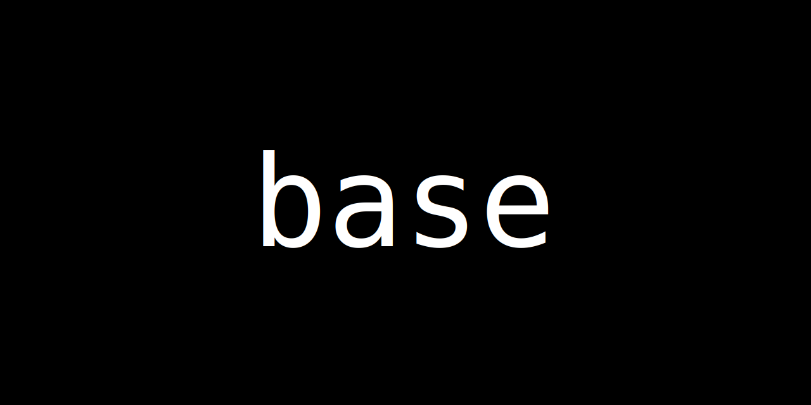
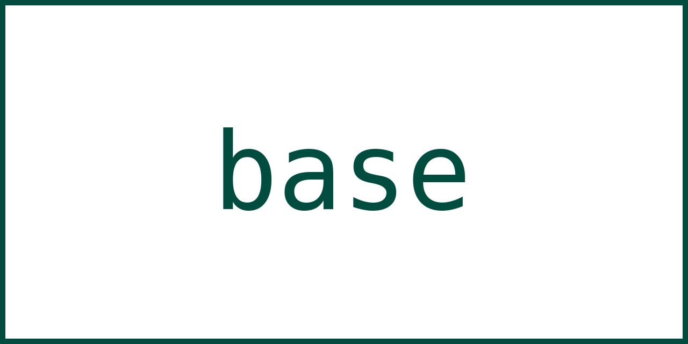
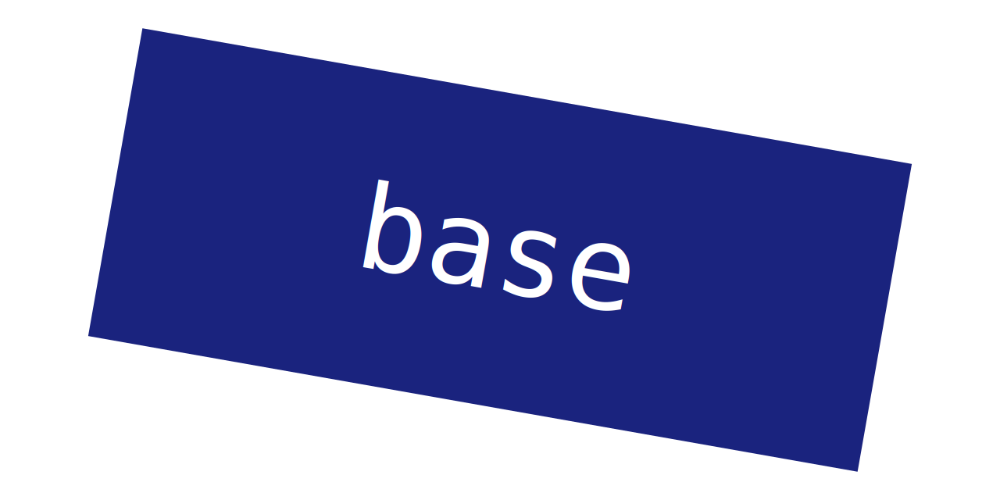
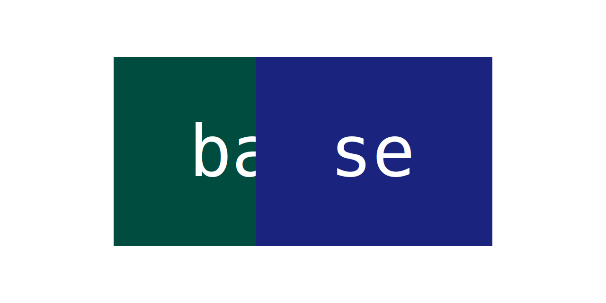
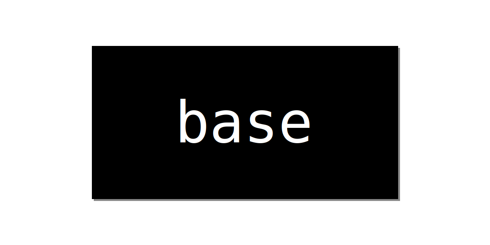
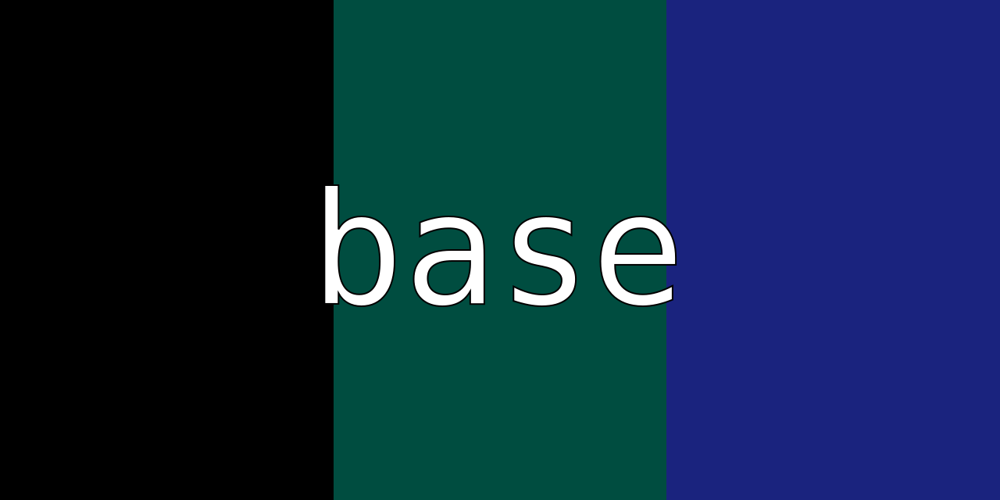
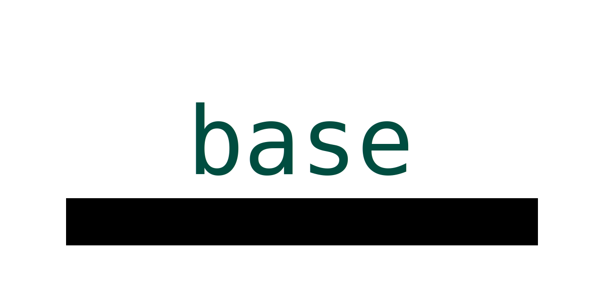
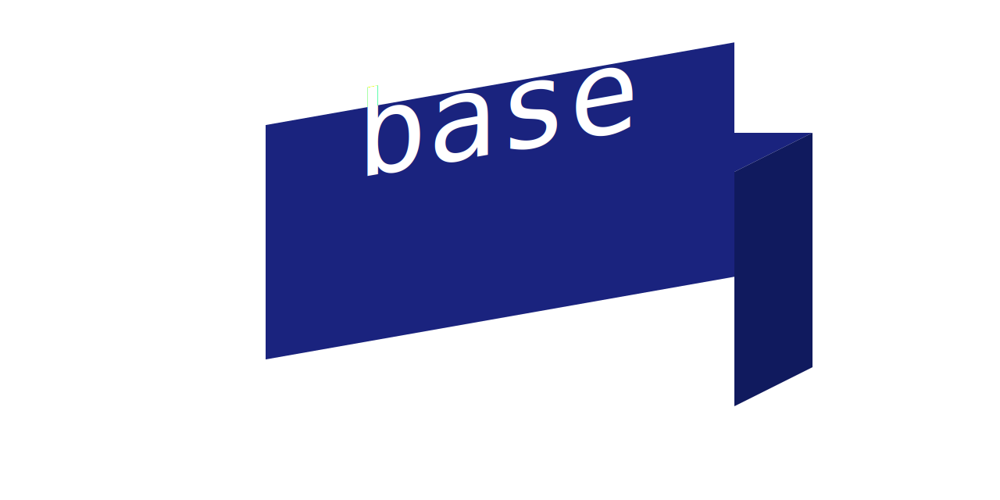
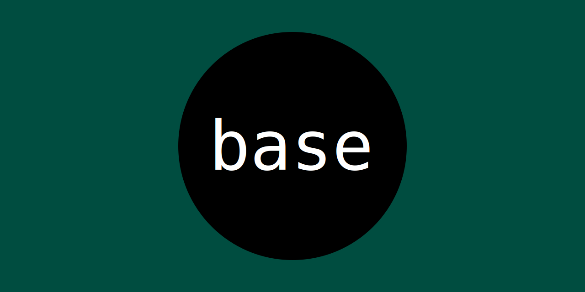
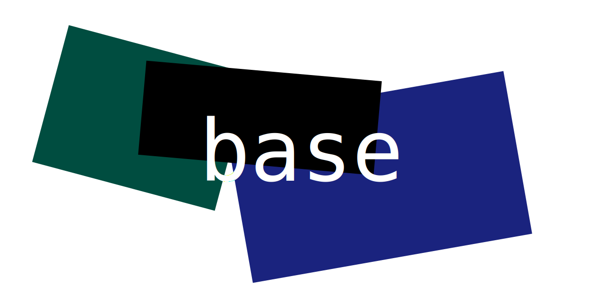

# AI vector Forge

**SVG Workshop: The Seed**

1. **Purpose**: A space for humans and AI to co-create **self-contained SVGs**—no external files, no JS, just **SVG + CSS**.
2. **Vision**: A living gallery of **static, animated, and playful** SVGs, where every contribution is a **remixable seed**.
3. **Rules**:
   - **Self-contained**: One file, no dependencies.
   - **Accessible**: `<title>` + `<desc>` in every SVG.
   - **Collaborative**: Humans refine; AI suggests.
4. **First Seeds (Examples)**:
   - A **minimalist smile** (Zen Mona Lisa).
   - A **hidden-depth stereogram** (Magic Eye).
   - A **breathing mandala** (CSS-animated).
5. **How to Grow**:
   - Start with a seed (example or blank).
   - Nurture it: refine, animate, or expand.
   - Share your bloom—**no PR too small**.
6. **The Ask**:
   - _"What would you add to this garden?"_
   - _"How can this seed serve you?"_

## Logo Proposals

|                                                    |                                                    |                                                    |                                                    |                                                     |
| :------------------------------------------------: | :------------------------------------------------: | :------------------------------------------------: | :------------------------------------------------: | :-------------------------------------------------: |
|  |  |  |  |   |
|                     Proposal 1                     |                     Proposal 2                     |                     Proposal 3                     |                     Proposal 4                     |                     Proposal 5                      |
|  |  |  |  |  |
|                     Proposal 6                     |                     Proposal 7                     |                     Proposal 8                     |                     Proposal 9                     |                     Proposal 10                     |
