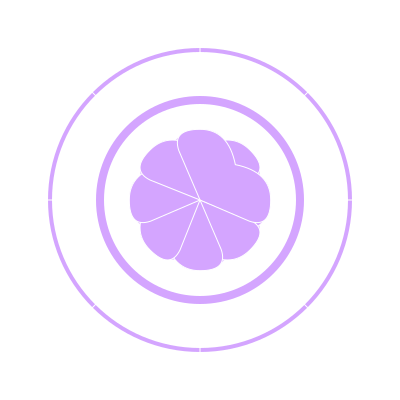

# [AI vector Forge](../../README.md) / [Gallery](../../gallery/README.md) / Breathing Mandala

This workshop is for a simple, CSS-animated "breathing" mandala. It is based on the "breathing mandala" seed idea.

## Preview

## Description

This SVG is a remixable seed for creating animated geometric patterns. The animation is a slow, pulsing zoom effect created with CSS keyframes.

## Files

- [mandala.svg](./mandala.svg) - The main SVG file for this workshop.

---

## Revision History

### v1

- [v1.svg](./revisions/v1.svg) - The original version of the SVG.

### v0

- [v0.svg](./revisions/v0.svg) - A previous version of the SVG.
