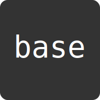

# [AI vector Forge](../../README.md) / [Logos](../../logos/README.md) / Base Logo

This workshop is for creating and iterating on a logo for the `base` template concept itself.

**Repository:** [attogram/base](https://github.com/attogram/base)

## Preview

## Description

This logo should represent the idea of a clean, solid, and reusable foundation for new projects.

## Files

- [base.svg](./base.svg) - The main SVG file for this workshop.

---

## Revision History

### v1

- [v1.svg](./revisions/v1.svg) - The original version of the SVG.
